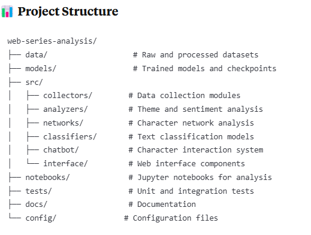

## AI-Driven Analysis and Character Interaction System for Web Series

📋 Project Overview:
This project leverages state-of-the-art AI and NLP techniques to provide comprehensive analysis of web series content, including theme identification, character relationship mapping, sentiment analysis, and an interactive character chatbot system. The system enables researchers, viewers, and content creators to gain deep insights into narrative structures and character dynamics through automated analysis.

🎯 Research Objectives:
1) To automate the analysis of complex narrative structures in web series
2) To provide quantitative insights into character relationships and plot development
3) To create an interactive experience through character-based chatbots
4) To enable researchers to study narrative patterns at scale
5) To assist content creators in understanding audience engagement patterns

🌟 Significance:
This project bridges the gap between traditional media analysis and modern AI capabilities, offering:
    1) Academic Impact: Provides tools for media studies, screenwriting analysis, and narrative research
    2) Industry Applications: Enables data-driven decision making for content creation and marketing
    3) Viewer Engagement: Offers immersive interaction with fictional characters
    4) Technical Innovation: Demonstrates novel applications of LLMs in entertainment analysis

✨ Key Features:
1. Automated Theme Analysis:
    1) Extracts main themes from episodes using advanced NLP techniques
    2) Identifies emotional arcs and sentiment trends throughout the series
    3) Provides comparative analysis across seasons
    4) Generates theme evolution visualizations

2. Character Network Mapping:
    1) Automatically identifies and tracks character appearances
    2) Maps relationships based on co-occurrences and dialogue patterns
    3) Calculates centrality metrics for character importance
    4) Visualizes dynamic relationship changes over time

3. Intelligent Scene Classification:
    1) Categorizes scenes by genre, mood, and content type
    2) Uses multi-label classification for complex scene analysis
    3) Supports custom taxonomy development
    4) Provides filtering and search capabilities

4. Interactive Character Chatbot:
    1) Emulates character personalities based on dialogue analysis
    2) Maintains conversation context and character knowledge
    3) Adapts responses to user interaction style
    4) Supports multiple character personalities

5. Personalized Analysis Dashboard:
    1) Customizable views for different user preferences
    2) Export capabilities for research purposes
    3) Real-time analysis updates
    4) Integration with external visualization tools 

🏗️ System Architecture
The system consists of five core components:
1) Data Collection Module: Web scraping with Scrapy
2) Theme & Sentiment Analysis: LLM implementation with Hugging Face
3) Character Network Analysis: NER with SpaCy and visualization with NetworkX/PyViz
4) Custom Text Classification: Theme-based scene categorization
5) Interactive Chatbot: Character dialogue emulation system

Chatbot Interaction Example: 
User: "Hello! How's the investigation going?"
Character Bot: "The case is getting more complex. We've uncovered new evidence linking the suspect to multiple locations. I need to review the forensics report again."

User: "What's your next move?"
Character Bot: "I'm heading to the crime scene to re-examine the evidence. Something doesn't add up, and I have a feeling we've missed a crucial detail."